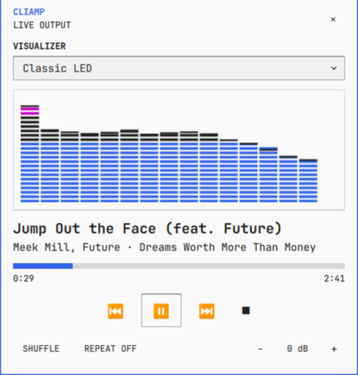

# Omarchy Shell Plugins

Personal third-party plugins for `omarchy-shell`.

## Quick Start

Local install from this checkout:

```bash
mkdir -p ~/.config/omarchy/plugins
rm -rf ~/.config/omarchy/plugins/omni
cp -a omni ~/.config/omarchy/plugins/omni
omarchy plugin validate ~/.config/omarchy/plugins/omni
omarchy plugin rescan
omarchy plugin enable omni
omarchy-restart-shell
```

Open Omni:

```bash
omarchy-shell shell toggle omni '{}'
```

Suggested Alt+Space binding for `~/.config/hypr/bindings.lua`:

```lua
hl.unbind("ALT + SPACE")
hl.bind("ALT + SPACE", hl.dsp.exec_cmd([[omarchy-shell shell toggle omni '{}']]), { description = "Omni" })
```

If this repository is added as a trusted plugin source, install with:

```bash
omarchy plugin source add https://github.com/bjarneo/omarchy-shell-plugins --as bjarneo
omarchy plugin add omni --from bjarneo --enable
```

Omarchy rejects symlinked plugin folders. Use real copied directories for local testing.

## Projects

### `omni`

Standalone Omarchy shell command palette for apps, Omarchy actions, files, themes, GitHub search, `tldr`, and local Ollama prompts.

Features:

- Overlay plugin enabled with `omarchy plugin enable omni`
- Searches installed desktop apps and a bundled Omarchy action index
- Drill-down categories for Quick, Apps, Files, GitHub, Favourites, History, and Themes
- File previews, theme swatches, GitHub repo/PR previews, `tldr` docs, and local Ollama prompt previews
- Uses Omarchy shell shared colors, font settings, and state fills through `qs.Commons`
- Keyboard controls: arrows or `j`/`k` to move, `Enter` to launch, `Esc` to unwind/close, `Ctrl+S` to favourite

Useful commands:

```bash
omarchy-shell shell toggle omni '{}'
omarchy-shell shell call omni toggle ""
omarchy-shell shell call omni openCategory Quick
omarchy-shell shell hide omni
```

Optional tools:

- `fd` for file search
- `gh` for GitHub search
- `tldr` for inline command docs
- `ollama` with `qwen3.5:0.8b` for local chat and command generation

See `omni/README.md` for details.

### `quickapps-hud`

Fast Iron Man-style quick-app launcher overlay for `omarchy-shell`.

Features:

- Animated hex app ring with a center arc-reactor readout
- Scanline sweep, HUD corner brackets, target beam, and launch charge flash
- Uses Omarchy shell shared colors through `qs.Commons`
- Unloads when hidden and only animates while open
- Reads apps from `~/.config/omarchy-quickapps-hud/apps.json`, with fallback to older quickapps config files

Install from this checkout:

```bash
mkdir -p ~/.config/omarchy/plugins
rm -rf ~/.config/omarchy/plugins/quickapps-hud
cp -a quickapps-hud ~/.config/omarchy/plugins/quickapps-hud
omarchy plugin validate ~/.config/omarchy/plugins/quickapps-hud
omarchy plugin enable quickapps-hud
omarchy-restart-shell
```

Launch it:

```bash
omarchy-shell shell toggle quickapps-hud '{}'
```

Override the HUD apps by creating `~/.config/omarchy-quickapps-hud/apps.json`, then refresh the open overlay:

```bash
omarchy-shell shell call quickapps-hud refresh ""
```

See `quickapps-hud/README.md` for details.

### `cliamp`

Top-right now-playing card for `cliamp`, loaded inside `omarchy-shell`.

Features:

- Appears when cliamp starts or changes songs, then hides itself after a few seconds
- Title and artist display with a themed visualizer
- Winamp-style spectrum visualizer powered by `cliamp visstream`
- Uses Omarchy shell shared colors and fonts through `qs.Commons`

Install from this checkout:

```bash
mkdir -p ~/.config/omarchy/plugins
rm -rf ~/.config/omarchy/plugins/cliamp
cp -a cliamp ~/.config/omarchy/plugins/cliamp
omarchy plugin validate ~/.config/omarchy/plugins/cliamp
omarchy plugin enable cliamp
omarchy-restart-shell
```

See `cliamp/README.md` for details.

### `cliamp-player`

Theme-aware `cliamp` bar player with native controls, a live spectrum, and song-change notifications.



Features:

- Horizontal and vertical Omarchy bar layouts
- Popup controls for playback, seeking, shuffle, repeat, volume, and cliamp visualizer modes
- Live 16-band spectrum through `ffmpeg`, with `cliamp visstream` fallback
- Mode-specific Canvas renderings for all built-in cliamp visualizers
- Top-right now-playing card with hover-aware automatic dismissal

Install from this checkout:

```bash
mkdir -p ~/.config/omarchy/plugins
rm -rf ~/.config/omarchy/plugins/cliamp-player
cp -a cliamp-player ~/.config/omarchy/plugins/cliamp-player
omarchy plugin validate ~/.config/omarchy/plugins/cliamp-player
omarchy plugin rescan
omarchy plugin enable cliamp-player
omarchy restart shell
```

See `cliamp-player/README.md` for requirements, settings, and controls.

### `codex-usage`

Codex bar widget that tracks your active ChatGPT plan's usage limits and reset times.

Features:

- Shows the primary limit's remaining percentage with an OpenAI Blossom mark
- Shows primary and secondary capacity, reset times, and plan in a panel
- Refreshes through Codex's local app server without reading credentials itself

Install from this checkout:

```bash
mkdir -p ~/.config/omarchy/plugins
cp -a codex-usage ~/.config/omarchy/plugins/codex-usage
omarchy plugin validate ~/.config/omarchy/plugins/codex-usage
omarchy plugin rescan
omarchy bar plugin add codex-usage --section right
omarchy restart shell
```

Codex CLI must be available on `PATH` and signed in with `codex login`. See `codex-usage/README.md` for details.

## Validate

```bash
omarchy plugin validate omni
omarchy plugin validate quickapps-hud
omarchy plugin validate cliamp
omarchy plugin validate cliamp-player
omarchy plugin validate codex-usage
qmllint omni/*.qml omni/components/*.qml
qmllint quickapps-hud/*.qml
qmllint cliamp/*.qml
qmllint cliamp-player/*.qml
python3 -c 'from pathlib import Path; p = Path("cliamp-player/analyzer.py"); compile(p.read_bytes(), str(p), "exec")'
qmllint codex-usage/*.qml
node codex-usage/Model.test.js
```

## License

MIT. See `LICENSE`.
