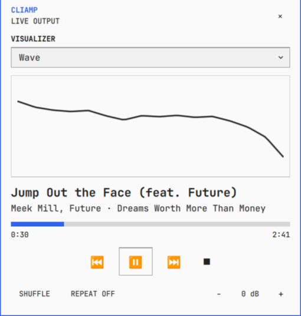
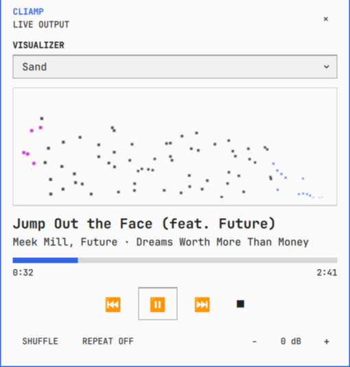
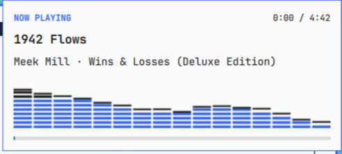

# Cliamp Player

Theme-aware Omarchy bar player for [`cliamp`](https://github.com/bjarneo/cliamp), with playback controls, a live spectrum, and an automatic now-playing card.

## Screenshots

<table>
  <tr>
    <th>Classic LED</th>
    <th>Wave</th>
    <th>Sand</th>
  </tr>
  <tr>
    <td></td>
    <td></td>
    <td></td>
  </tr>
</table>

The screen-local song-change card uses the same live mode:



## Features

- Native Omarchy bar button for horizontal and vertical bars
- Track title and optional artist label on horizontal bars
- Full popup controls for playback, seeking, shuffle, repeat, and volume
- All built-in cliamp visualizer modes selectable from the popup
- Live 16-band spectrum with peak decay
- Top-right now-playing card on cliamp start and track changes
- Automatic card dismissal with configurable duration
- Live Omarchy colors, fonts, spacing, and bar placement
- No machine-specific paths or Python packages
- Analyzer processes run only while the popup or now-playing card is visible

## Requirements

- Linux running Omarchy shell and Quickshell
- `cliamp` v1.63.2 or newer, with `status --json` and remote-control commands available on `PATH`
- Python 3
- One spectrum backend:
  - Preferred: `ffmpeg` with PulseAudio input support
  - Fallback: `cliamp visstream` (included in cliamp v1.63.2)
- Optional: `pactl` for resolving the current default output monitor by name

The preferred backend observes the current default PulseAudio/PipeWire output monitor while cliamp is playing. It receives the complete output mix, not a cliamp-exclusive stream, so other audible applications can influence the spectrum. A sink change is detected and reopened automatically.

If ffmpeg capture fails, the analyzer falls back to `cliamp visstream`. If both backends fail, metadata and playback controls continue working and the visualizer displays `NO LIVE AUDIO`. Silence is valid audio data and does not trigger fallback.

## Install

### Trusted plugin source

After this repository has been added as a trusted Omarchy source:

```bash
omarchy plugin source add https://github.com/dylanmccavitt/omarchy-cliamp-player --as dylanmccavitt
omarchy plugin add cliamp-player --from dylanmccavitt --enable
omarchy restart shell
```

### Local checkout

From an `omarchy-shell-plugins` checkout:

```bash
mkdir -p ~/.config/omarchy/plugins
rm -rf ~/.config/omarchy/plugins/cliamp-player
cp -a cliamp-player ~/.config/omarchy/plugins/cliamp-player
omarchy plugin validate ~/.config/omarchy/plugins/cliamp-player
omarchy plugin rescan
omarchy plugin enable cliamp-player
omarchy restart shell
```

Enabling the plugin adds its bar widget when it is not already present. Reposition it through Omarchy bar settings or `omarchy bar move cliamp-player --section right`.

## Interaction

### Bar

- Left-click: open or close the player
- Right-click: play or pause
- Middle-click: next track
- Scroll: change volume by 2 dB

The icon dims whenever cliamp is not actively playing.

### Player

- Click the progress track to seek
- Previous, play/pause, next, and stop controls
- Shuffle and repeat-mode controls
- Volume down/up controls
- Visualizer dropdown for changing the spectrum rendering mode
- Click outside the card or use its close button to dismiss it

The visualizer dropdown mirrors `cliamp vis list` and switches modes through `cliamp vis <name>`. The popup and now-playing card render a mode-specific Canvas treatment from the same live spectrum data.

### Now-playing card

The card appears when cliamp starts or the track changes. Hovering pauses its dismissal timer. Clicking it opens the full player.

## Visualizer modes

The dropdown is populated from `cliamp vis list`. Selecting a row sends `cliamp vis <name>`, so cliamp's own TUI and every Cliamp Player surface stay on the same mode.

| Family | Built-in modes |
| --- | --- |
| Bars and meters | Bars, Bars Dot, Bars Outline, Bricks, Columns, Classic Peak, Ascii, Classic LED, Stereo |
| Plots and symmetry | Wave, Scope, Heartbeat, Butterfly, Terrain, Retro, Pulse |
| Particles and scenes | Rain, Scatter, Flame, Matrix, Binary, Sakura, Firework, Bubbles, Firefly, Mosaic, Sand, Geyser, Logo |
| Disabled | None |

Cliamp exposes normalized spectrum bands, not its terminal framebuffer. `Spectrum.qml` therefore reproduces each mode's visual language with a native Canvas renderer rather than copying terminal cells. Colors continue to follow the active Omarchy theme.

## Shell lifecycle

Cliamp Player uses Omarchy's live bar-widget lifecycle instead of a fixed plugin-local IPC handler. These commands continue working after bar and plugin reloads:

```bash
omarchy-shell shell summon cliamp-player
omarchy-shell shell hide cliamp-player
omarchy-shell shell toggle cliamp-player
```

## Settings

The bar settings panel exposes:

- `maxWidth`: maximum horizontal track-label width, 80–400 px
- `showArtist`: include the artist in the horizontal bar label
- `autoHideMs`: now-playing card duration, 1500–15000 ms

## Architecture

- `Widget.qml`: bar integration and pointer lifecycle
- `PlayerController.qml`: cliamp state, semantic commands, polling, and analyzer lifecycle
- `PlayerPopup.qml`: interactive player surface
- `NowPlayingOverlay.qml`: per-screen song-change card and dismissal timer
- `Spectrum.qml`: reusable Canvas renderer for all built-in cliamp visualizer modes
- `analyzer.py`: stdlib-only spectrum backend and strict NDJSON output

Each bar instance owns its controller and its screen-local popup/card. No singleton or `qmldir` is required.

## Verify

From the repository root:

```bash
omarchy plugin validate cliamp-player
qmllint cliamp-player/*.qml
python3 -c 'from pathlib import Path; p = Path("cliamp-player/analyzer.py"); compile(p.read_bytes(), str(p), "exec")'
cliamp status --json | jq -e '.ok and (.visualizer | type == "string")'
cliamp vis list
```

Runtime verification requires cliamp playback because spectrum data is intentionally not mocked.

## Troubleshooting

### Widget is missing

```bash
omarchy plugin validate ~/.config/omarchy/plugins/cliamp-player
omarchy plugin rescan
omarchy plugin enable cliamp-player
omarchy restart shell
```

### Metadata works but the visualizer is empty

Confirm that cliamp is playing and that at least one capture backend works:

```bash
ffmpeg -hide_banner -f pulse -i @DEFAULT_MONITOR@ -t 1 -f null -
cliamp visstream --fps 5
```

The ffmpeg backend listens to the complete default output mix. If ffmpeg or the active monitor fails, the analyzer automatically falls back to `cliamp visstream`.

### The selected mode does not change

Confirm cliamp v1.63.2 or newer is running, then test the same IPC path directly:

```bash
cliamp vis list
cliamp vis ClassicLED
cliamp status --json | jq -r '.visualizer'
```

The expected final output is `ClassicLED`.

## Relationship to the `cliamp` overlay

This repository's `cliamp-player` is an independent `bar-widget` plugin. The existing `cliamp` project in [`bjarneo/omarchy-shell-plugins`](https://github.com/bjarneo/omarchy-shell-plugins/tree/main/cliamp) is a persistent `overlay` plugin with a different ID, entry point, process model, and user interface. The two can coexist, although enabling both produces two now-playing cards.

The initial Winamp-style segmented-analyzer behavior and now-playing concept were informed by that MIT-licensed plugin. Its copyright notice is retained in this repository's `LICENSE`. The interactive player, command controller, demand-driven analyzer, visualizer-mode renderer, bar integration, and portability hardening are separate implementations.

## License

MIT
